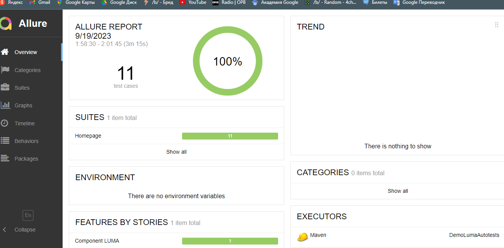
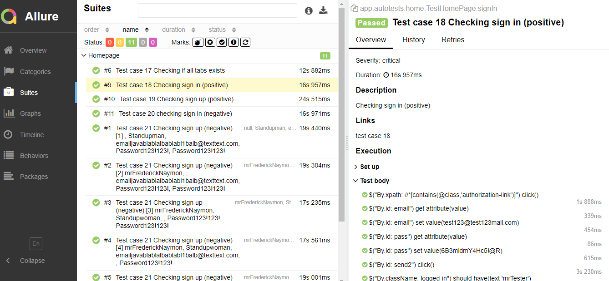

# Project settings

After cloning the repo on local machine:  

1. Go to *File -> Project Structure*
2. Go to the *Project* and for *SDK* field choose *Java 11* (need to be downloaded)
3. Click *Apply*

# Launch using Maven with InelliJ IDEA plugin

1. Open *Maven*
2. Open up *DemoSoftwareAutotests* -> *Lifecycle*
3. Click *clean*
4. Click *test*

# Generating allure-report

After launching tests using maven:  

1. Open *Maven*
2. Open up *DemoSoftwareAutotests* -> *Plugins* -> *allure*
3. Click *allure:report*

The report will be generated in `target/site/allure-maven-plugin/index.html`

Few examples of allure-report:

# Driver settings

All driver setting implements in *Driver.java*.  
Path `src/main/java/com/softwaretestingboard/magento/app/helpers/Driver.java`

# Chromedriver

Chromedriver for Windows locates at path: `src/test/resources/chromedriver/windows_{VERSION}/chromedriver.exe`

Chromedriver for Linux locates at path: `src/test/resources/chromedriver/linux_{VERSION}/chromedriver`

Chromedriver for MacOS locates at path: `src/test/resources/chromedriver/macos_{VERSION}/chromedriver`
